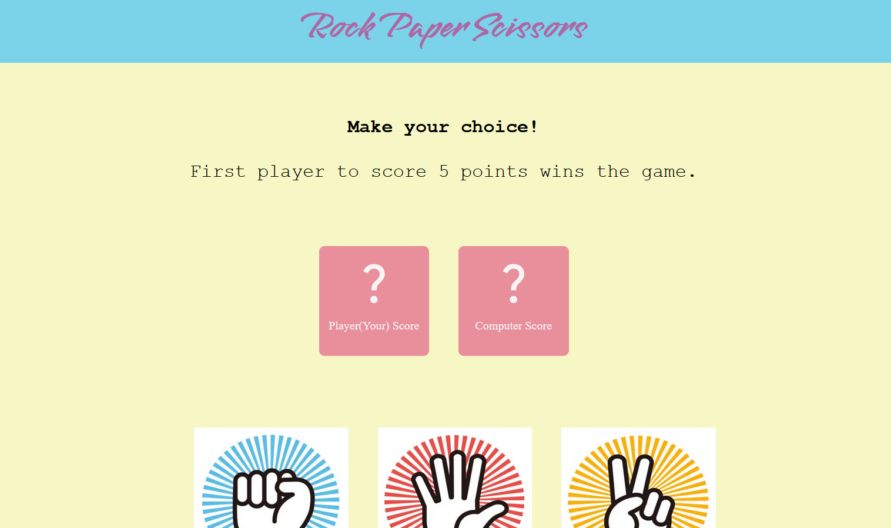

# Rock Paper Scissors

## Overview

Rock Paper Scissors is a simple game implemented using pure HTML, CSS, and JavaScript. The game allows players to choose between rock, paper, or scissors and plays against the computer. The game outcome is determined based on traditional rules.



## Features

- **User Interface:** Designed with HTML and CSS, featuring buttons for rock, paper, and scissors, and displaying game results.
- **Game Logic:** JavaScript handles player inputs, generates random computer choices, and determines the winner according to Rock Paper Scissors rules.
- **Interactive Experience:** Real-time updates on game results and interactions.

## How to Play

1. Choose your option by clicking one of the buttons (rock, paper, or scissors).
2. The computer will make a choice randomly.
3. The game will display the result and indicate the winner.

## Installation

1. Clone the repository:
   ```bash
   git clone https://github.com/your-username/rock-paper-scissors.git
